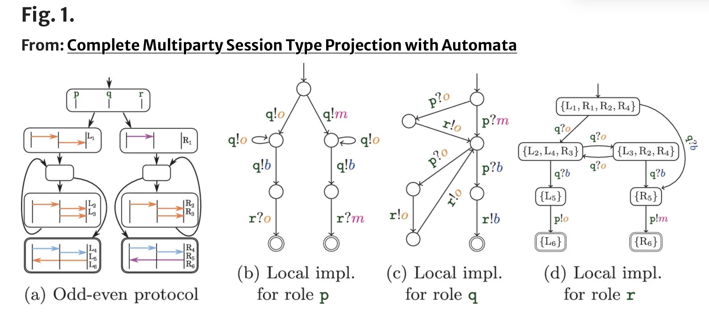

# Fault-tolerant multiparty session types

**Encadrant.e.s et équipe :** Étienne Lozes, Cinzia Di Giusto. SCALE (COMRED)

**Contact :**
etienne.lozes@univ-cotedazur.fr

### Description

MOTS-CLES: automates, algorithmique distribuée.

Les types de session multi-parties sont des automates finis servant à spécifier de manière globale un protocole d'échanges de messages entre plusieurs agents. Plus précisément, un type "global" est un automate fini dont les transitions sont étiquettées par des "flèches" $p->q:m$ (l'agent $p$ envoie à l'agent $q$ le message $m$). L'ensemble des flèches forment un alphabet partiellement commutatif. Une classe d'équivalence d'un "mot de flèches" est appelé un *diagramme de séquence* (Message Sequence Chart, MSC). Un type global se projete sur chaque agent $p$ en un type "local" qui est un automate communicant étiquetté par des actions d'envoi $!m$ ou de réception $?m$ de messages. La mise en parallèle de tous ces types locaux est le système projeté associé au global type. Le système projeté accepte lui aussi des diagrammes de séquence: chaque système local vérifie que la suite d'actions de son processus est bien dans son langage. Le global type est dit *réalisable* si son système projeté reconnait seulement les diagrammes de séquence du global type. C'est aujourd'hui le critère fondamental que doit respecter un global type pour être "sûr" (voir par exemple [1,2]).

Ce stage vise à explorer la notion de global type au-delà de la réalisabilité. Un global type qui n'est pas réalisable conduit à un système projeté qui reconnait des diagrammes de séquence qui sont en-dehors du langage du global type, correspondant à des exécutions où les agents se sont "décorellés". Plutôt que de renoncer à un tel global type, on souhaite ajouter des mécanismes de correction dans le système projeté, soit en ajoutant de l'information sur les messages transmis pour éviter des décorelations (c'est une construction connue, mais compliquée, connue sous le nom d'automates de Zielonka [3,4,5]), soit en "corrigeant" la décorellation une fois détectée, en ajoutant des messages "de retour sur panne", permettant aux agents de se mettre d'accord soit pour "revenir en arrière" dans le protocole à un point où ils n'étaient pas décoreller, soit pour se recoreller avec un processus. Le stage pourra conduire soit à une étude bibliographique sur les constructions d'automates de Zielonka, en partant de ses variantes simplifiées récentes, soit d'explorer la deuxième piste, totalement inexplorée, à base de messages de correction.

[1] [Complete Multiparty Session Type Projection with Automata](https://link.springer.com/chapter/10.1007/978-3-031-37709-9_17) Elaine Li, Felix Stutz, Thomas Wies & Damien Zufferey CAV'23

[2] [Realisability and Complementability of Multiparty Session Types](https://arxiv.org/abs/2507.17354) Cinzia Di Giusto, Étienne Lozes, Pascal Urso PPDP'25

[3] [Synthesising Asynchronous Automata from Fair Specifications](https://arxiv.org/abs/2504.14623) Béatrice Bérard, Benjamin Monmege, B. Srivathsan, Arnab Sur

[4] [Notes on finite asynchronous automata](http://www.numdam.org/item?id=ITA_1987__21_2_99_0)  Wieslaw Zielonka. Theoretical Informatics and Applications, 21(2):99–135, 1987. 

[5] [Optimal Zielonka-type construction of deterministic asynchronous automata]() Blaise Genest, Hugo Gimbert, Anca Muscholl, and Igor Walukiewicz. ICALP'10.

