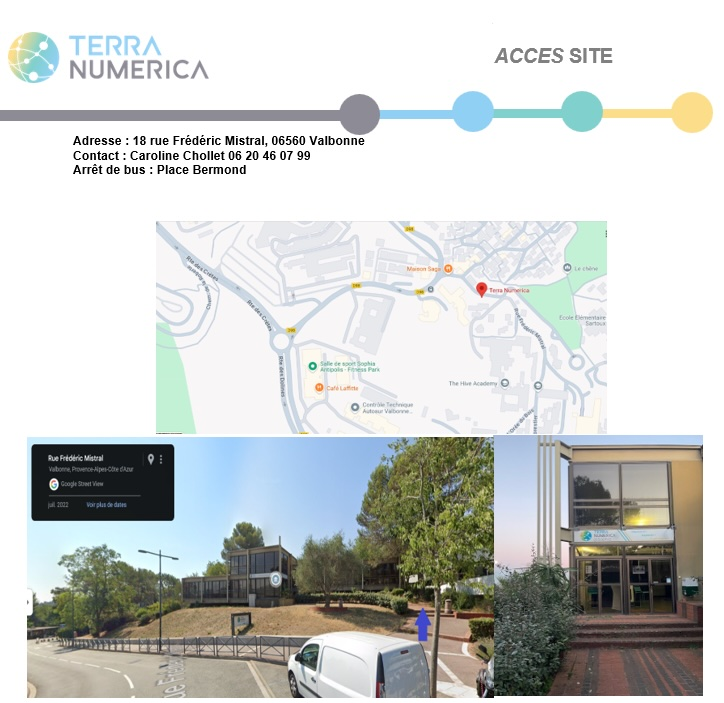

## Programme de la visite à Terra Numerica

### Réseaux verts 
Découvrez le fonctionnement d’un réseau de ville durable grâce à une maquette 3D interactive.
Explorez les principes d’optimisation des réseaux de télécommunication et de distribution d’énergie en identifiant des solutions innovantes pour améliorer l’efficacité énergétique d’un aménagement urbain.
Expérimentez en testant différentes possibilités de connexion entre des utilisateurs et des bornes réseaux.
Notions abordées : Algorithme, réseaux, fréquence, optimisation 

### Devin Binaire
Découvrez le fonctionnement et l’écriture du binaire à travers ce tour de magie et révélez vos talents d’informaticien(ne).
Explorez le système binaire utilisé par les ordinateurs en convertissant un nombre de binaire en décimal et vice-versa.
Expérimentez la représentation binaire des nombres en réalisant vous-même ce tour de magie surprenant.
Notions abordées : Ecriture binaire des nombres, codage en binaire, passage de binaire à décimal, multiple, dichotomie, exponentielle

### Géométrie du ballon de foot sur écran 3D
Découvrir la géométrie non-plane et la projection 3D tout en observant la présence des mathématiques dans les objets du quotidien, même dans un ballon de football.
Explorer les notions de géométrie : des formes de base (polygones, angles) aux théorèmes plus avancés (formule d’Euler, polyèdres réguliers) jusqu’aux notions de courbure et de surface.
Expérimentez grâce à des projections sphériques pour comprendre la conception des célèbres ballons de foot tel que Telstar et en analyser leur design.
Notions abordées : modélisation, géométrie, polyèdres, polygones, angles, sphère, pavage, surface, courbe, courbures,
Pendule Inversé
Découvrez comment et pourquoi l'apprentissage automatique révolutionne notre utilisation des ordinateurs sur la base d'applications dans le secteur de la médecine ou des transports.
Explorez les différents aspects de la robotique : la mécanique (équilibre. forces...), les composants (moteur, capteurs, contrôleur...), les méthodes de commande et de régulation (basée sur les modèles ou issue d'apprentissage).
Expérimentez en jouant avec une manette de jeux vidéo pour tenter de maintenir le pendule à la verticale.
Notions abordées : Automatique, mécanique (équilibre stable et instable, forces, accélération, ...), technologie, régulation, méthode basée sur les modèles, apprentissage par renforcement.

### Activité Page Rank
Découvrez le fonctionnement de l’algorithme de recommandation PageRank et ses enjeux éthiques grâce à un réseau de train. Chaque gare représente un jeu et les trajets simulent les liens entre pages web et recommandations.
Explorez pourquoi certaines gares sont plus fréquentées sur d’autres et comprenez la base du principe de recommandation que l’on peut retrouver derrière les pages web ou les réseaux sociaux.
Expérimentez en lançant un train en marche et en comptabilisant ses passages grâce à une application qui traduit les fréquences de visite révélant le mécanisme de convergence de PageRank.
Notions abordées : Algorithmes, programmes, algorithmes de recommandation, marche aléatoire.

## Plan
Voici également quelques précisions pour rejoindre notre site au besoin via le plan ci-dessous

